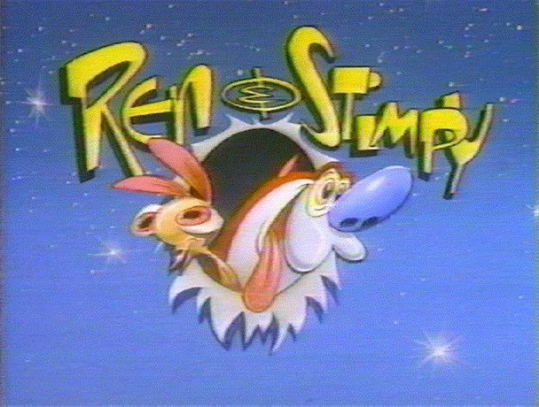

# 📺 Ren & Stimpy Show | Visual Studio Code Theme

Visual Studio Code theme inspired on *Ren & Stimpy Show* color palette.

## But... Why?

Actually, why not? I have been thinking about doing a Visual Studio Code theme for a while now, but I have never decided on which color palette to follow or if I'd just create a palette exclusively for this, until one night, it ocurred to me that maybe I should just follow some color palette from a 90s TV show, and why not *Ren & Stimpy* which has been a great memory from my childhood.

So here it is! Hope you enjoy it 😊✨

## Color choices

So, here is the thing. I said that I wanted to follow some color palette but.. after I decided that I would do that, I didn't know where to start. I had seen that Ren & Stimpy colors are pretty much always the same ones. So to make it a little more entertaining, I decided to use a color palette from a particular character from the show, per language.
