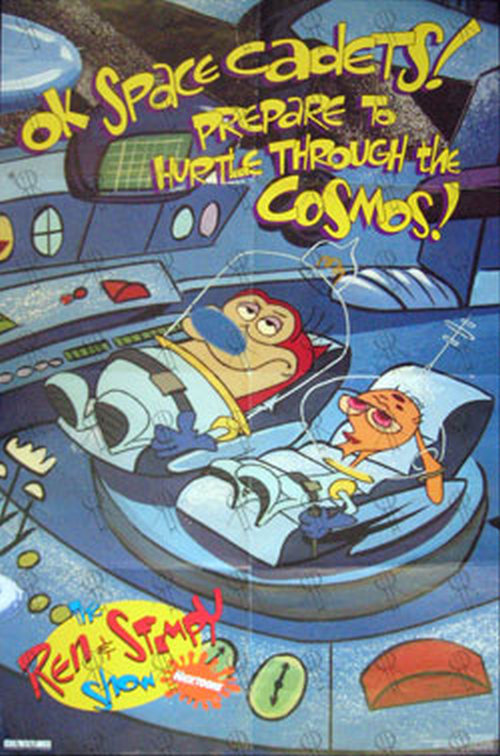
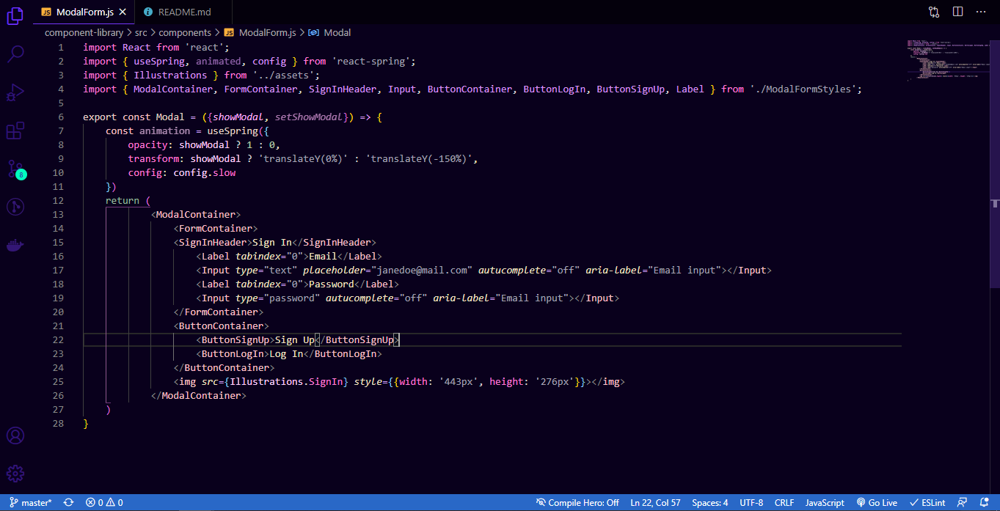

# Ren & Stimpy Show: Space Madness 📺🪐🌌 | VSCode Theme

Visual Studio Code theme inspired on *Ren & Stimpy Show Space Madness* color palette.

## But... Why

Actually, why not? I have been thinking about doing a Visual Studio Code theme for a while now, but I have never decided on which color palette to follow or if I'd just create a palette exclusively for this, until one night, it ocurred to me that maybe I should just follow some color palette from a 90s TV show, and why not *Ren & Stimpy* which has been a great memory from my childhood.

So here it is! Hope you enjoy it 😊✨

## Color choices 🎨

So, here is the thing. I said that I wanted to follow some color palette but.. after I decided that I would do that, I didn't know where to start. I had seen that Ren & Stimpy colors are pretty much always the same. So to make it a little more interesting, I decided to use a color palette from a particular character from the show, per language.
Therefore, I used Stimpy's color palette for HTML, Ren's color palette for Javascript and Mr. Toast Man for CSS.
Languages were particularly chose to work on a React Project, BUT this is an open source repo, with MIT License so:

## The Idea

If you want to contribute to this _idea_, and choose a particular character and make the palette for another language you want, I dont know... Python, Typescript, C#, Sass, you name it: Please, feel free to do it! ⚡ The more languages we cover, the more people will get to use this theme.

Okay, that's it for now. Enjoy ❤️

Vicky
 
PS: Please, for any feedback or issues, go to [Repo Issues](https://github.com/victoriasuarez97/RenandStimpy_VSCodeTheme/issues).
